# Technical Audit Report: Wildfire Appraisers

**Date:** March 19, 2024
**Version:** 1.0

## Executive Summary

This technical audit report presents a comprehensive analysis of the Wildfire Appraisers project, evaluating its architecture, security, code quality, and engineering practices. The audit was conducted to assess the current state of the codebase and provide recommendations for improvement.

## Overall Score Summary

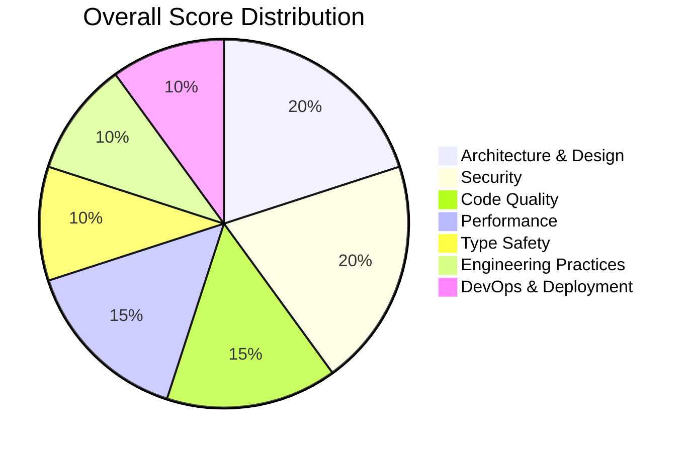

| Category              | Score (10) | Weight | Weighted Score |
| --------------------- | ---------- | ------ | -------------- |
| Architecture & Design | 7.5        | 20%    | 1.5            |
| Security              | 6.5        | 20%    | 1.3            |
| Code Quality          | 7.0        | 15%    | 1.05           |
| Performance           | 7.0        | 15%    | 1.05           |
| Type Safety           | 5.0        | 10%    | 0.5            |
| Engineering Practices | 6.5        | 10%    | 0.65           |
| DevOps & Deployment   | 5.0        | 10%    | 0.5            |
| **Total**             |            |        | **6.55**       |

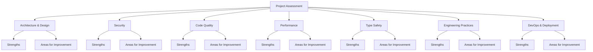

## Table of Contents

- [Technical Audit Report: Wildfire Appraisers](#technical-audit-report-wildfire-appraisers)
  - [Executive Summary](#executive-summary)
  - [Overall Score Summary](#overall-score-summary)
  - [Table of Contents](#table-of-contents)
  - [Detailed Findings](#detailed-findings)
    - [1. Architecture \& Design (Score: 7.5/10)](#1-architecture--design-score-7510)
      - [Strengths](#strengths)
      - [Areas for Improvement](#areas-for-improvement)
    - [2. Security (Score: 6.5/10)](#2-security-score-6510)
      - [Strengths](#strengths-1)
      - [Areas for Improvement](#areas-for-improvement-1)
    - [3. Code Quality (Score: 7.0/10)](#3-code-quality-score-7010)
      - [Strengths](#strengths-2)
      - [Areas for Improvement](#areas-for-improvement-2)
    - [4. Performance (Score: 7.0/10)](#4-performance-score-7010)
      - [Strengths](#strengths-3)
      - [Areas for Improvement](#areas-for-improvement-3)
    - [5. Type Safety (Score: 5.0/10)](#5-type-safety-score-5010)
      - [Strengths](#strengths-4)
      - [Areas for Improvement](#areas-for-improvement-4)
    - [6. Engineering Practices (Score: 6.5/10)](#6-engineering-practices-score-6510)
      - [Strengths](#strengths-5)
      - [Areas for Improvement](#areas-for-improvement-5)
    - [7. DevOps \& Deployment (Score: 5.0/10)](#7-devops--deployment-score-5010)
      - [Strengths](#strengths-6)
      - [Areas for Improvement](#areas-for-improvement-6)
  - [Critical Issues](#critical-issues)
  - [Recommendations](#recommendations)
    - [High Priority](#high-priority)
    - [Medium Priority](#medium-priority)
    - [Low Priority](#low-priority)
  - [Implementation Timeline](#implementation-timeline)
    - [Phase 1 (1-2 months)](#phase-1-1-2-months)
    - [Phase 2 (2-3 months)](#phase-2-2-3-months)
    - [Phase 3 (1-2 months)](#phase-3-1-2-months)
  - [Conclusion](#conclusion)
  - [Appendix](#appendix)
    - [A. Technology Stack](#a-technology-stack)
    - [B. Audit Methodology](#b-audit-methodology)
    - [C. References](#c-references)

## Detailed Findings

### 1. Architecture & Design (Score: 7.5/10)

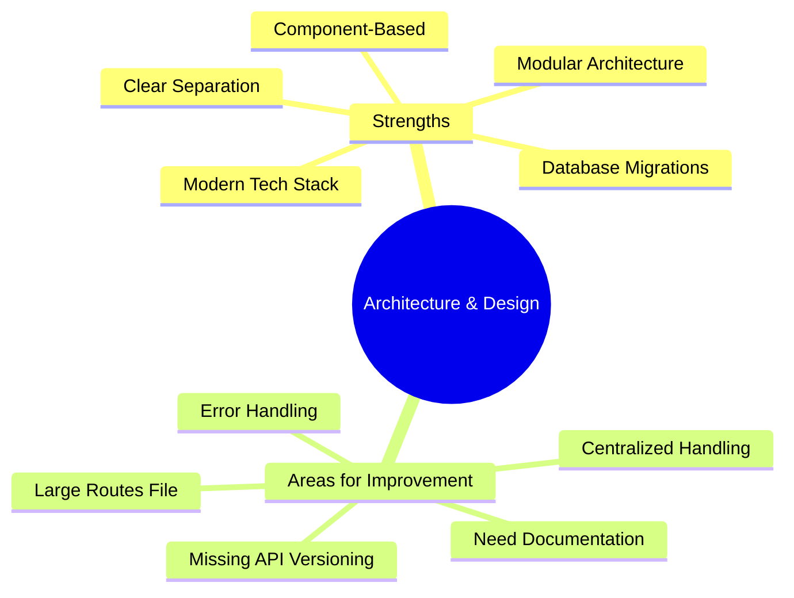

#### Strengths

- Clear separation of concerns between frontend and backend
- Modular architecture with well-organized directories
- Modern tech stack (SvelteKit, Express.js, Sequelize)
- Well-structured database migrations
- Component-based frontend architecture

#### Areas for Improvement

- Large routes file (2576 lines) needs modularization
- Missing API versioning
- Need for API documentation
- Inconsistent error handling patterns
- Missing centralized error handling

### 2. Security (Score: 6.5/10)

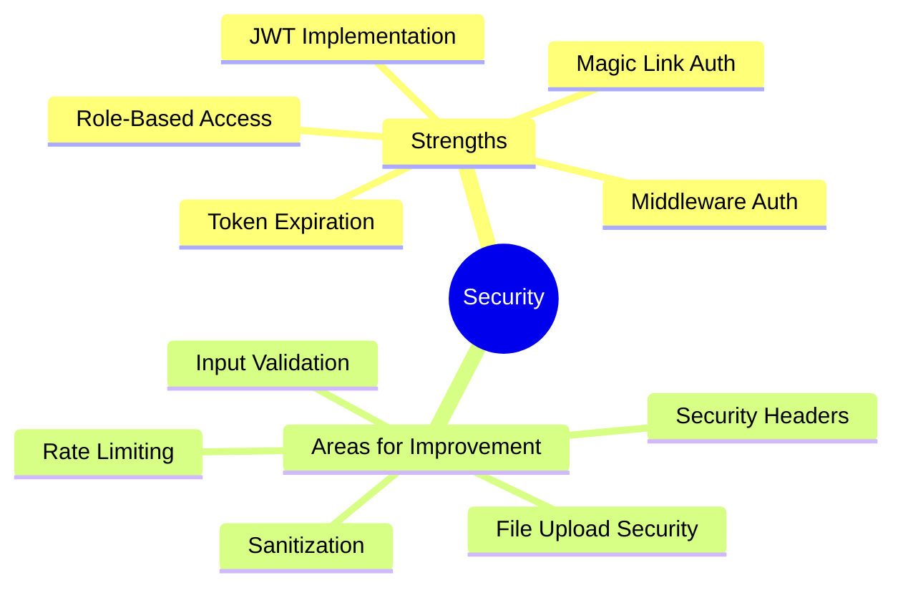

#### Strengths

- JWT implementation with access/refresh tokens
- Magic link authentication system
- Token expiration handling
- Role-based access control
- Middleware-based authorization

#### Areas for Improvement

- Missing security headers (Helmet.js)
- No rate limiting implementation
- Limited input validation
- Missing sanitization for user inputs
- Basic file upload security
- No virus scanning for uploads

### 3. Code Quality (Score: 7.0/10)

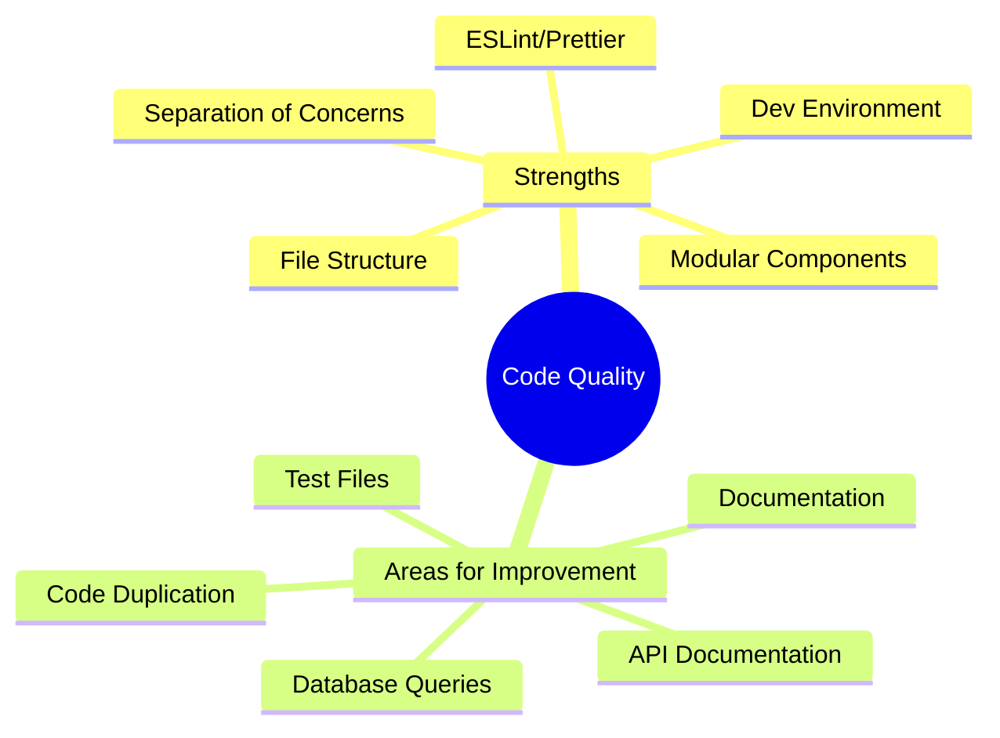

#### Strengths

- Consistent file structure
- Clear separation of concerns
- Modular components
- ESLint and Prettier configuration
- Development environment setup

#### Areas for Improvement

- Limited inline documentation
- Missing API documentation
- No visible test files
- Code duplication in routes
- Duplicate database queries

### 4. Performance (Score: 7.0/10)

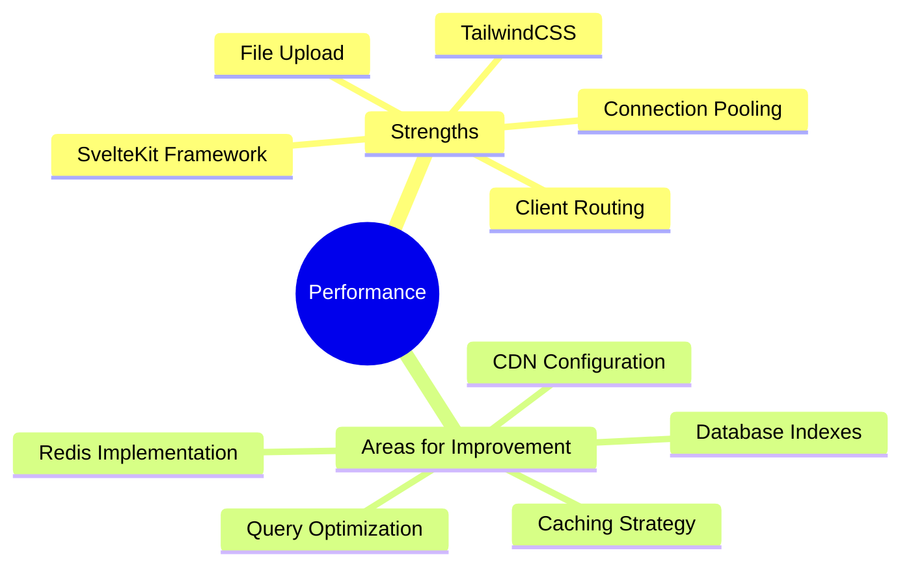

#### Strengths

- Modern SvelteKit framework
- TailwindCSS for optimized styling
- Client-side routing
- Connection pooling for database
- Efficient file upload handling

#### Areas for Improvement

- No caching strategy
- Missing Redis implementation
- No database indexes
- No query optimization
- Missing CDN configuration

### 5. Type Safety (Score: 5.0/10)

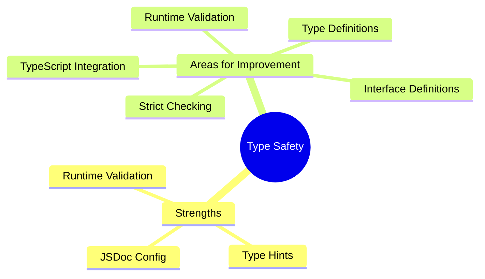

#### Strengths

- Basic JSDoc configuration
- JavaScript with type hints
- Some runtime validation

#### Areas for Improvement

- Limited TypeScript integration
- Missing type definitions
- No strict type checking
- Missing interface definitions
- No runtime type validation

### 6. Engineering Practices (Score: 6.5/10)

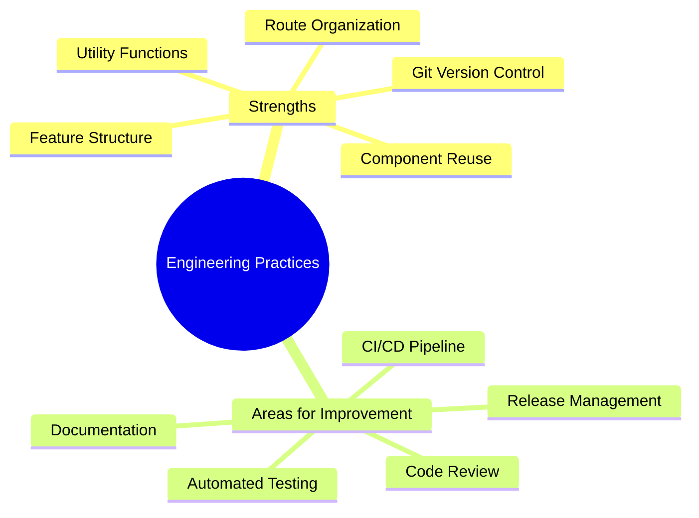

#### Strengths

- Feature-based folder structure
- Component reusability
- Utility functions separation
- Route-based organization
- Git version control

#### Areas for Improvement

- No CI/CD pipeline
- Limited automated testing
- Missing code review process
- No release management
- Limited documentation

### 7. DevOps & Deployment (Score: 5.0/10)

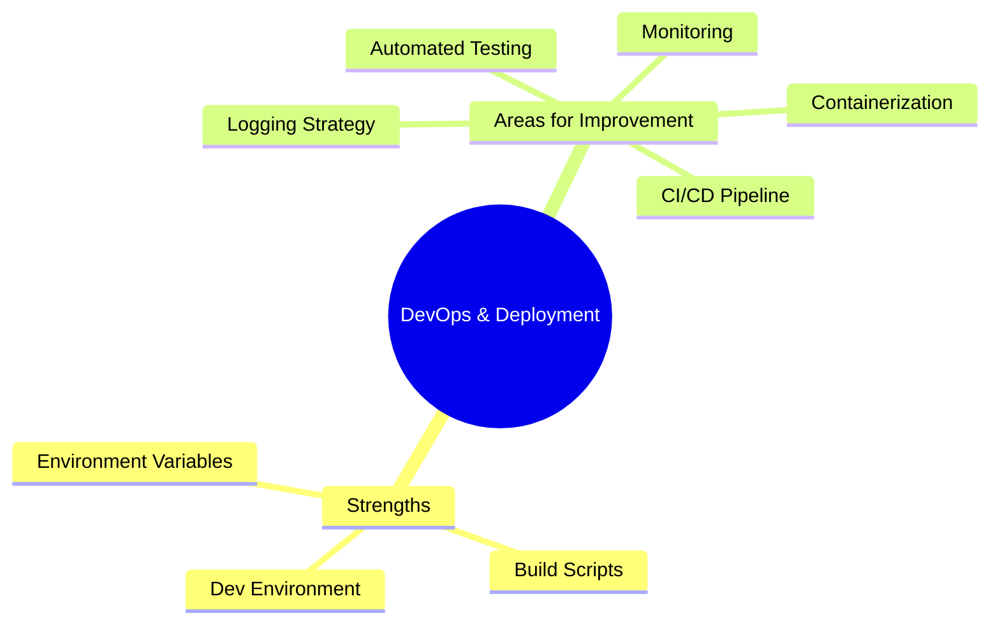

#### Strengths

- Environment variable management
- Basic build scripts
- Development environment setup

#### Areas for Improvement

- No containerization
- Missing CI/CD pipeline
- No automated testing
- Limited monitoring
- No logging strategy

## Critical Issues

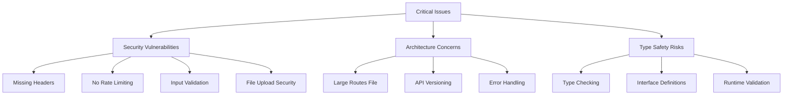

1. **Security Vulnerabilities**

   - Missing security headers
   - No rate limiting
   - Limited input validation
   - Basic file upload security

2. **Architecture Concerns**

   - Large monolithic routes file
   - Missing API versioning
   - Inconsistent error handling

3. **Type Safety Risks**
   - Limited type checking
   - Missing interface definitions
   - No runtime validation

## Recommendations

### High Priority

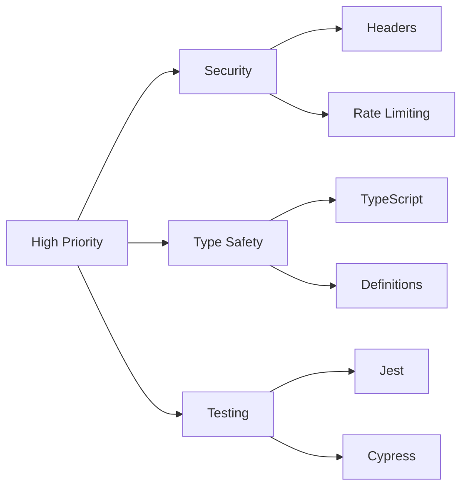

1. **Security Enhancements**

   ```javascript
   // Add security headers
   const helmet = require("helmet");
   app.use(helmet());

   // Add rate limiting
   const rateLimit = require("express-rate-limit");
   app.use(
     rateLimit({
       windowMs: 15 * 60 * 1000,
       max: 100,
     })
   );
   ```

2. **Type Safety**

   - Implement TypeScript
   - Add proper type definitions
   - Implement runtime validation

3. **Testing Infrastructure**
   - Set up Jest for unit testing
   - Implement Cypress for E2E testing
   - Add test coverage reporting

### Medium Priority

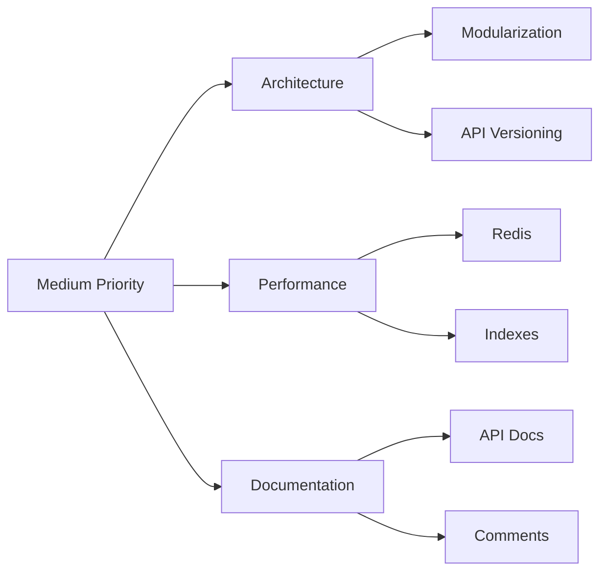

1. **Architecture Improvements**

   - Modularize routes
   - Implement API versioning
   - Add centralized error handling

2. **Performance Optimization**

   - Implement Redis caching
   - Add database indexes
   - Set up CDN

3. **Documentation**
   - Add API documentation
   - Improve code comments
   - Create architecture diagrams

### Low Priority

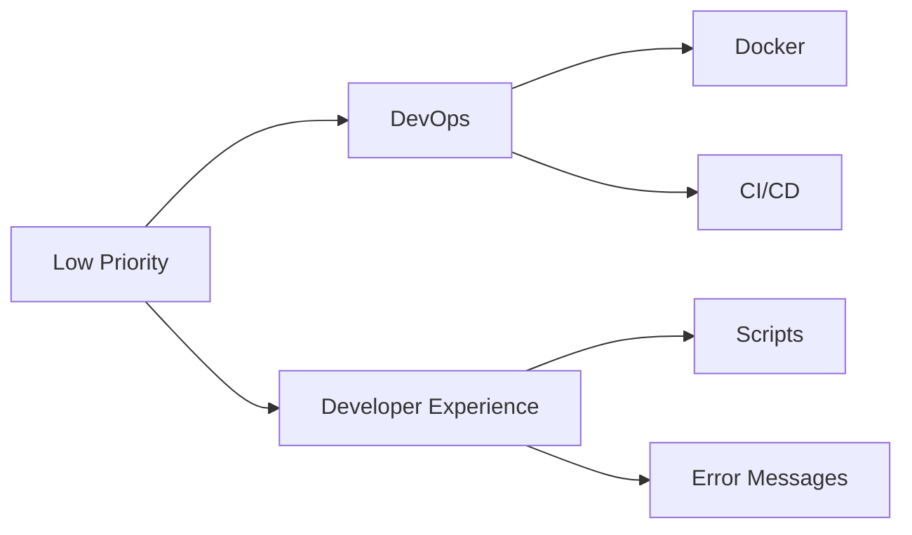

1. **DevOps Setup**

   - Implement Docker
   - Set up CI/CD pipeline
   - Add monitoring tools

2. **Developer Experience**
   - Add development scripts
   - Improve error messages
   - Add debugging tools

## Conclusion

The Wildfire Appraisers project shows promise with its modern tech stack and clear architecture, but requires significant improvements in security, type safety, and engineering practices. The overall score of 6.55/10 indicates a solid foundation but highlights the need for focused improvements in critical areas.

## Appendix

### A. Technology Stack

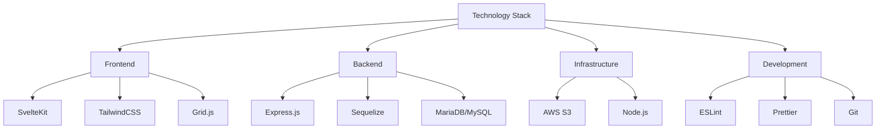

- Frontend: SvelteKit, TailwindCSS, Grid.js
- Backend: Express.js, Sequelize, MariaDB/MySQL
- Infrastructure: AWS S3, Node.js
- Development: ESLint, Prettier, Git

### B. Audit Methodology

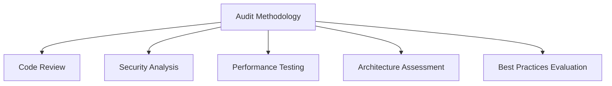

1. Code Review
2. Security Analysis
3. Performance Testing
4. Architecture Assessment
5. Best Practices Evaluation

### C. References

- Project Documentation
- Code Repository
- Development Guidelines
- Industry Standards
